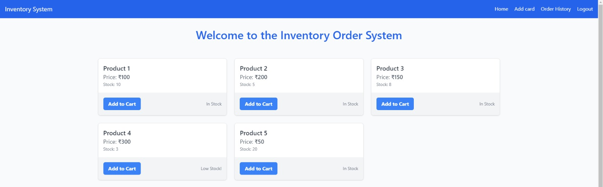
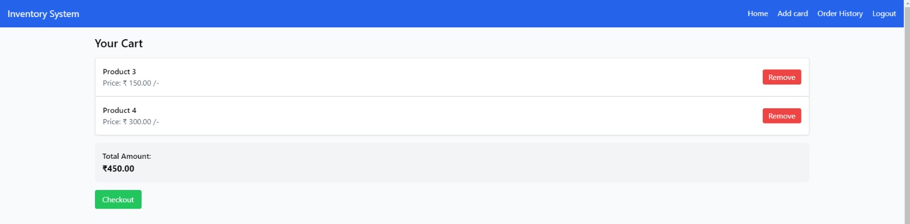
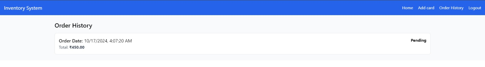

# Inventory order management(Create React App)

## Project Overview
This is an interactive and user-friendly Inventory and Order Management System built using React and Tailwind CSS. It allows customers and admins to manage products and orders efficiently. The app provides customers the ability to browse products, add items to their cart, and track their order history. Admin users have access to an admin panel where they can add, update, and delete products, as well as monitor low-stock products that need restocking. this website is available on : https://inventory-order-management-theta.vercel.app/login





## Features

### For Customers:
- Product Catalog: Customers can view a list of available products, including details like name, price, and stock status.
- Shopping Cart: Customers can add products to their cart and remove them if necessary. The cart is stored in local storage for persistence across sessions.
- Order History: Customers can track their past orders, with details such as order date, status, and total amount.

### For Admins:
- Admin Panel: Admins can add, edit, and delete products from the inventory.
- Low Stock Alerts: Products with low stock are highlighted in the admin panel to notify admins for restocking.
- Product Management: Admins can view and manage the entire product catalog, updating details like price and stock levels.

### Technologies Used
- React: For building dynamic UI components and managing state.
- Tailwind CSS: For efficient and responsive styling.
- Context API: For state management across the application.
- LocalStorage: For persisting cart and product data locally.
- React Router: For navigation between different views/pages in the application.

## How to Run the Project
- Clone the repository:
```
git clone https://github.com/desai-pratik/inventory-order-management.git
```
- Navigate to the project directory:
```
cd inventory-order-management
```
- Install the dependencies:
```
npm install
```
- Start the development server:
```
npm start
```
- Open the application in your browser at http://localhost:3000.
